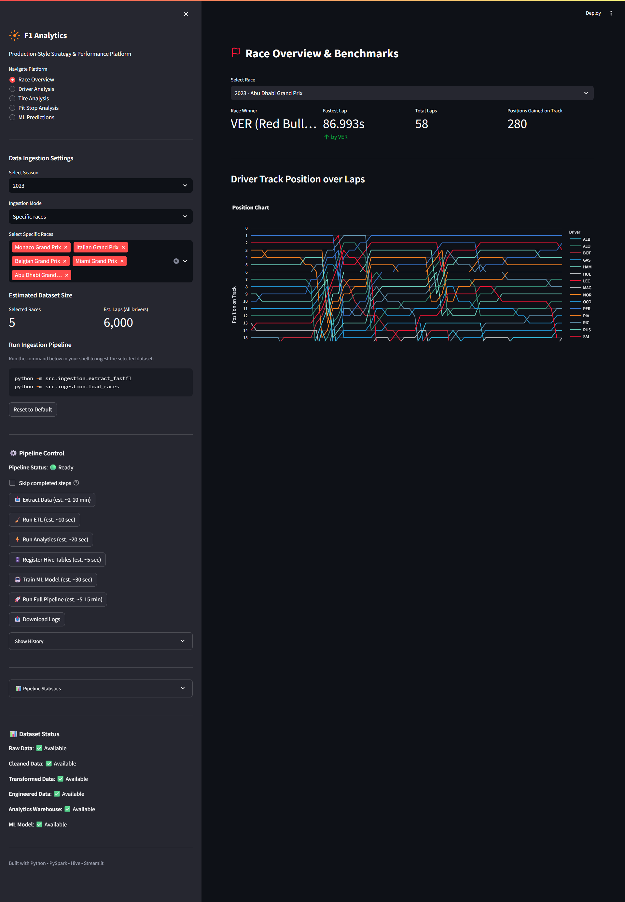
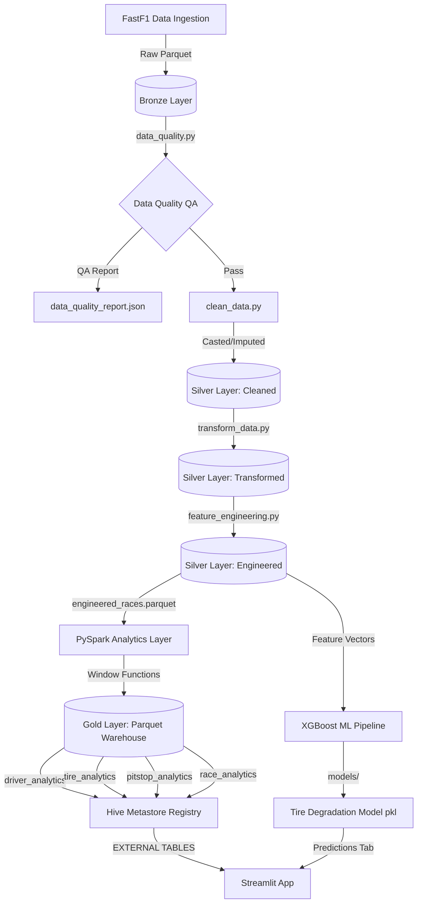
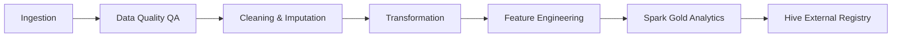
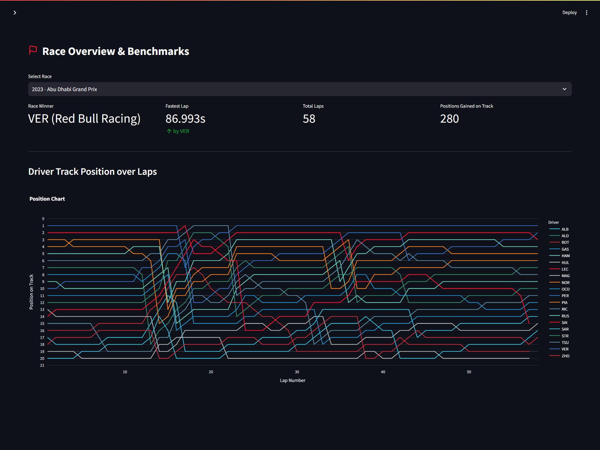
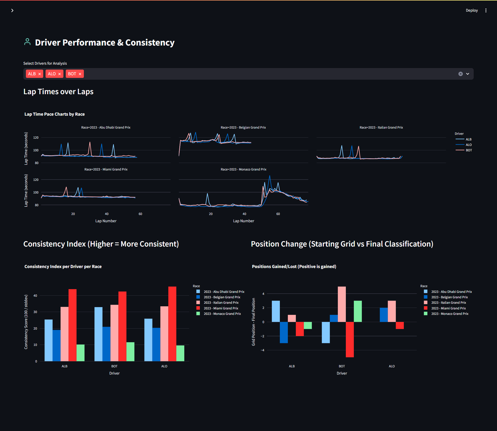
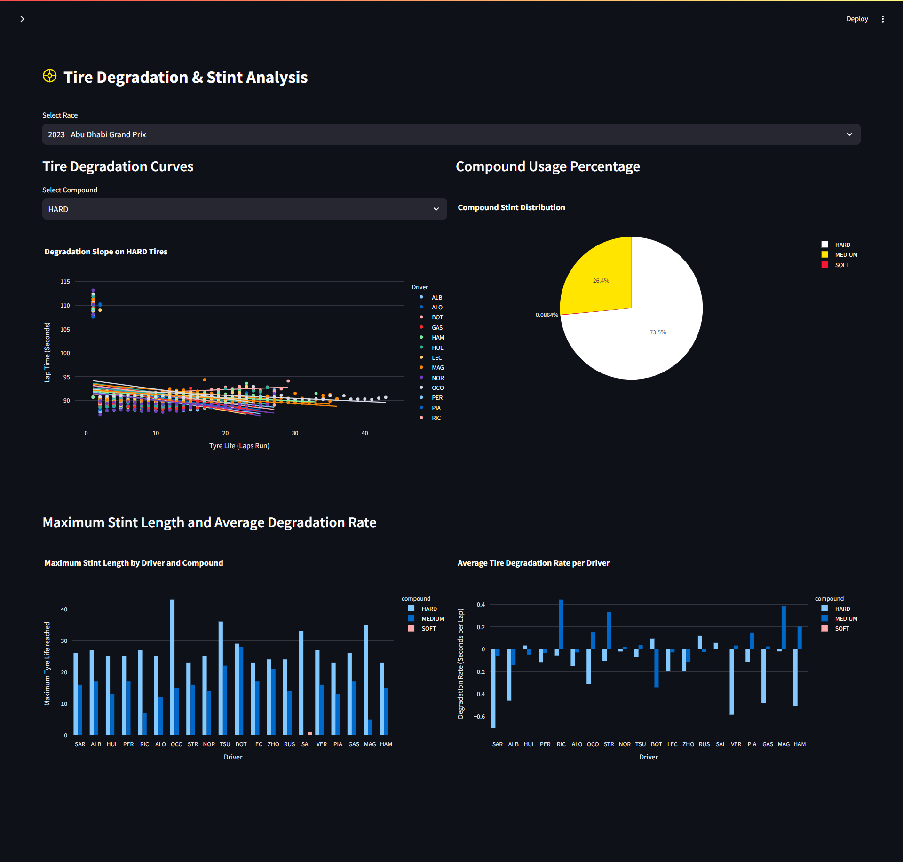
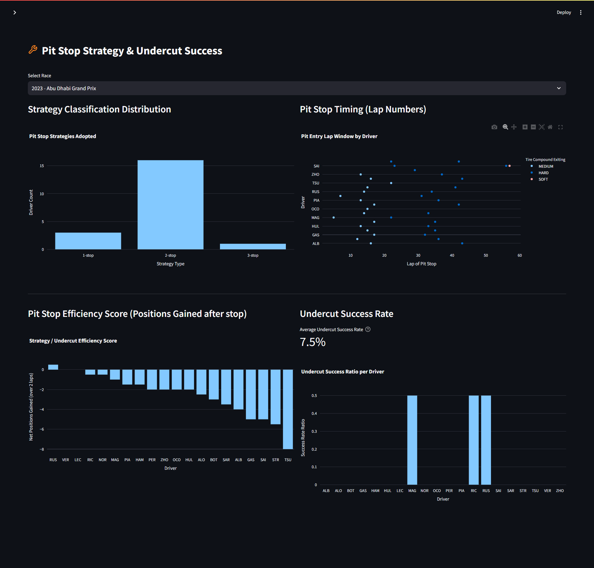
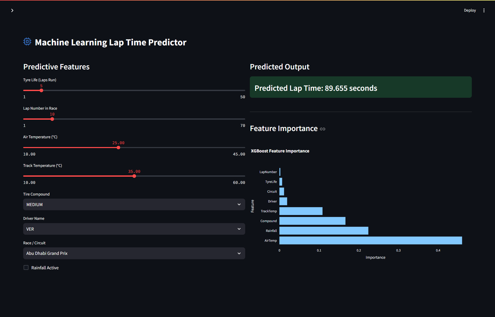

# F1 Telemetry Analytics Platform

[](https://www.python.org/)
[](https://spark.apache.org/)
[](https://streamlit.io/)
[](https://xgboost.readthedocs.io/)
[](https://hive.apache.org/)
[](https://opensource.org/licenses/MIT)

An end-to-end Formula 1 telemetry analytics platform built using real-world race data. The system ingests telemetry, weather, and results data, processes it through a Medallion-style ETL pipeline, runs advanced analytical aggregations in Spark, exposes tables through a local Hive metastore, trains an XGBoost ML pipeline to predict lap times, and serves interactive visualizations via a Streamlit dashboard.

## Dashboard Preview



## Resume Summary

Designed and developed an end-to-end Formula 1 telemetry analytics platform using FastF1, PySpark, Hive, Streamlit, and XGBoost. Built scalable ETL pipelines, engineered race strategy features, implemented distributed analytics using Spark window functions, and deployed machine learning models for lap-time prediction with R² = 0.90.

---

## Key Engineering Highlights

- Built an end-to-end Formula 1 telemetry analytics platform
- Processed 5,800+ race telemetry records across multiple Grand Prix events
- Implemented ETL pipelines with automated data quality validation
- Developed PySpark analytical workloads using window functions and partitioned Parquet storage
- Integrated Hive external tables over a decoupled analytics warehouse
- Trained and deployed an XGBoost model achieving R² = 0.90 for lap time prediction
- Built an interactive Streamlit dashboard for race strategy and performance analytics

---

## 1. Architecture Overview

The platform is built on a decoupled, Medallion-style data architecture to ensure separation of concerns between raw ingestion, cleaning, feature engineering, big data analytics, and modeling.

The project uses a simplified Medallion-style architecture where:
* **Raw** = Bronze Layer (`data/raw/`)
* **Processed** = Silver Layer (`data/processed/`)
* **Warehouse** = Gold Layer (`data/warehouse/`)

This avoids confusion when mapping directory structures to data warehouse concepts.



---

## 2. Technology Stack

* **Core Language**: Python 3.10+
* **Ingestion Source**: FastF1 (incorporating lap timing, sector deltas, weather telemetry, and race results)
* **ETL & Data Prep**: Pandas, NumPy
* **Big Data Processor**: PySpark (executed locally in `local[*]` mode)
* **Metastore / Storage Management**: Embedded Apache Derby database with Apache Hive metastore integration, configured dynamically via SparkSession
* **Data Format**: Apache Parquet (column-oriented, partitioned)
* **Machine Learning**: Scikit-Learn, XGBoost, Joblib
* **Visualization Dashboard**: Streamlit, Plotly Express
* **Testing Framework**: Python standard `unittest`

---

## 3. Project Structure

```text
F1-Telemetry-Analytics/
├── cache/                 # FastF1 download cache (git-ignored)
├── dashboards/            # Streamlit dashboard files
│   ├── assets/            # Embedded offline SVG icons and images
│   └── streamlit_app.py   # Main dashboard entrypoint
├── data/
│   ├── raw/               # Bronze: raw Parquet files from FastF1
│   ├── processed/         # Silver: cleaned, transformed, and engineered files
│   └── warehouse/         # Gold: Decoupled analytical Parquet files and Hive DB
│       └── hive/          # Embedded metastore database (metastore_db, derby.log)
├── docs/                  # Documentation and resume/portfolio materials
│   └── portfolio_kit.md   # Resume, STAR details,STAR talking points, and demo scripts
├── models/                # Serialized machine learning models (XGBoost .pkl)
├── src/
│   ├── etl/               # ETL scripts (data quality, clean, transform, engineer)
│   │   ├── clean_data.py
│   │   ├── data_quality.py
│   │   ├── feature_engineering.py
│   │   └── transform_data.py
│   ├── hive/              # Hive schema definition and query runners
│   │   ├── analytics_queries.sql
│   │   ├── create_tables.sql
│   │   ├── register_tables.py
│   │   └── run_queries.py
│   ├── ingestion/         # Ingestion scripts to fetch data via FastF1 API
│   │   ├── extract_fastf1.py
│   │   └── load_races.py
│   ├── ml/                # XGBoost ML training script
│   │   └── tire_prediction.py
│   ├── spark/             # SparkSession builder and SQL aggregation layers
│   │   ├── driver_analytics.py
│   │   ├── pitstop_analytics.py
│   │   ├── race_analytics.py
│   │   ├── spark_session.py
│   │   └── tire_analytics.py
│   └── utils/             # Paths, configurations, and environment constants
│       └── config.py
├── tests/                 # Unit testing suite
│   ├── test_etl.py
│   └── test_spark.py
├── requirements.txt       # Python package dependencies
└── README.md              # Project developer documentation
```

---

## 4. ETL & Analytical Pipelines

The pipeline follows a sequential, decoupled pattern to ingest, clean, transform, and analyze the telemetry data.



### Ingestion (Bronze Layer)
- Reads the race configurations (2023 Season, Races: Bahrain, Monaco, Monza, Silverstone, Spa).
- Contacts the FastF1 API to pull lap timing and weather data, writing them to `data/raw/` as raw Parquet files.

### Data Quality & Cleaning (Silver Layer)
- **Data Quality (`data_quality.py`)**: Runs null inspections, duplicate lap checking, invalid time filtering, and tire compound validations, exporting results to `data_quality_report.json`.
- **Data Cleaning (`clean_data.py`)**: Renames columns to `snake_case`, programmatically converts timedeltas to float seconds, casts nanosecond datetimes to microsecond precision for Spark Parquet compatibility, and imputes numeric values with column medians.
- **Ergast API Retirement Fallback**: Maps historical grid and final positions dynamically based on driver numbers to prevent null skew caused by the Ergast API retirement.
- **Transformation (`transform_data.py`)**: Calculates row-level sector deltas against the fastest lap sector of the race, computes a rolling 5-lap pace average (`race_pace_index`), and calculates `circuit_performance_score` (representing average pace compared to the field).
- **Feature Engineering (`feature_engineering.py`)**: Computes stint lengths and fits a stint-level multi-variable linear regression model (`lap_time ~ tyre_life + air_temp + track_temp`) to extract the exact `tire_degradation_rate` per driver.

### PySpark Analytics (Gold Layer)
Using window and aggregation functions, four analytical modules compute decoupled Parquet outputs inside `data/warehouse/` partitioned by `season` and `race_name`:
1. **Driver Analytics**: Average lap times, fastest lap, position changes, and a consistency index (`100.0 / stddev` rounded to 2 decimal places).
2. **Tire Analytics**: Maximum stint lengths, average pace per compound, and stint-level compound usage percentage.
3. **Pit Stop Analytics**: Strategy types (stops count), average pit window, undercut success rate (filtering DNFs), and pit efficiency score.
4. **Race Analytics**: Theoretical fastest sector times, overall average race pace, clean pace rankings, and estimated positions gained on track.

### Hive Metastore Integration
- **`create_tables.sql`**: DDL creating external Hive tables referencing the Gold Parquet folders, partitioned by `season` and `race_name`.
- **`register_tables.py`**: A Spark runtime controller that reads the SQL statements, dynamically replaces path placeholders with the machine's absolute Posix paths, registers them in the local Derby metastore, and executes `MSCK REPAIR TABLE` to mount partitions.
- **Derby Relocation**: Built-in configurations relocation prevents the Derby metastore database from polluting the root directory, confining all database binaries to `data/warehouse/hive/`.

---

## 5. Machine Learning (XGBoost Pipeline)

* **Script**: `src/ml/tire_prediction.py`
* **Algorithm**: `XGBRegressor` (configured with `n_estimators=120`, `learning_rate=0.08`, `max_depth=5`).
* **Feature Vector**:
  * **Categoricals (OrdinalEncoded)**: `Compound`, `Circuit`, `Driver`
  * **Numerics (Passthrough)**: `TyreLife`, `LapNumber`, `AirTemp`, `TrackTemp`, `Rainfall`
* **Performance Results on 20% holdout**:
  * **$R^2$ Score**: 0.9022
  * **Mean Absolute Error (MAE)**: 1.452 seconds
  * **Root Mean Squared Error (RMSE)**: 3.644 seconds
* **Model Serialization**: Saves the trained preprocessing and model pipeline to `models/tire_degradation_model.pkl` for Streamlit deployment.

---

## 6. Streamlit Dashboard

The interactive web dashboard is styled with inline SVG icons for offline reliability and includes 5 tabs:
1. **Race Overview**: P1 race metrics, fastest lap indicators, and an interactive Plotly tracker displaying position history across laps.
2. **Driver Performance**: Pacelines comparison charts, consistency index metrics, and position changes waterfall charts.
3. **Tire Degradation**: Interactive stint degradation charts with Plotly trendlines, stint lengths, and compound distributions.
4. **Pit Stop Strategy**: Strategy distribution bar charts, pit timing scatter plots, and undercut efficiency tracking.
5. **ML Predictor**: Formulates input vectors via sliders (Tyre Life, Lap Number, Temp) to predict lap times using the trained XGBoost model and renders model feature importances.

## Dashboard Screenshots

### Race Overview


### Driver Analysis


### Tire Analysis


### Pit Stop Analysis


### ML Predictions


---

## Results

| Metric | Value |
|----------|----------|
| Total Laps Processed | 5,821 |
| Races Analyzed | 5 |
| Engineered Features | 53 |
| ML R² Score | 0.9022 |
| ML MAE | 1.452 s |
| ML RMSE | 3.644 s |
| Hive Tables | 4 |
| Dashboard Pages | 5 |

---

## 7. Installation & Setup

### Prerequisites
* **Python**: Version 3.10.x
* **Java SDK**: JDK 8 or 11 (64-bit) configured in your system environment variable (`JAVA_HOME`) for PySpark compatibility.

### Local Installation
1. Clone this repository:
   ```powershell
   git clone https://github.com/your-username/F1-Telemetry-Analytics.git
   cd F1-Telemetry-Analytics
   ```
2. Create and activate a Python virtual environment:
   ```powershell
   python -m venv venv
   .\venv\Scripts\activate
   ```
3. Install dependencies:
   ```powershell
   pip install -r requirements.txt
   ```

---

## 8. How to Run

### Step 1: Run the ETL Pipeline (Support for Dynamic Race Ingestion)
The platform supports dynamic race ingestion where you can build datasets on demand. Selections made in the Streamlit dashboard sidebar are saved to `config/selected_races.json` and automatically loaded by the pipeline. 

Alternatively, you can run the extraction pipeline headlessly using command-line arguments:
```powershell
# Extract specific races (e.g., Monaco and Spa for the 2023 season)
python -m src.ingestion.extract_fastf1 --season 2023 --mode "Specific races" --selection "Monaco Grand Prix, Belgian Grand Prix"

# Extract the first 5 races of the 2024 season
python -m src.ingestion.extract_fastf1 --season 2024 --mode "First N races" --selection 5

# Extract the entire 2023 season
python -m src.ingestion.extract_fastf1 --season 2023 --mode "Entire season"
```

Once raw telemetry is extracted, execute the downstream ETL steps to clean, transform, and engineer features:
```powershell
python -m src.ingestion.load_races
python -m src.etl.data_quality
python -m src.etl.clean_data
python -m src.etl.transform_data
python -m src.etl.feature_engineering
```
By default, if no custom selections or CLI arguments are provided, the pipeline falls back to the original 5-race 2023 configuration (Bahrain, Monaco, Monza, Silverstone, and Spa) to ensure backward compatibility.

### Step 2: Run PySpark Analytics & Hive Registration
Generate gold datasets and register them in your local Hive metastore database:
```powershell
python -m src.spark.driver_analytics
python -m src.spark.tire_analytics
python -m src.spark.pitstop_analytics
python -m src.spark.race_analytics
python -m src.hive.register_tables
```

### Step 3: Run the Analytical SQL Queries
Execute the Spark SQL analysis script to print reports to the console:
```powershell
python -m src.hive.run_queries
```

### Step 4: Train the ML Model
Train and export the XGBoost regressor pipeline:
```powershell
python -m src.ml.tire_prediction
```

### Step 5: Launch the Streamlit Dashboard
Run the web application locally:
```powershell
streamlit run dashboards/streamlit_app.py
```

---

## 9. Testing & Quality Assurance

Unit tests mock the Pandas ETL layers and run a local Spark session to verify standard deviations, consistency scores, and tire usage proportions:
```powershell
python -m unittest discover -s tests
```
*Expected output: `Ran 9 tests. OK`*

---

## 10. Future Enhancements

1. **Delta Lake Integration**: Transition Gold Parquet folders to Delta Tables to leverage ACID transactions and schema enforcement.
2. **dbt Modeling**: Move SQL queries to a formal dbt Core pipeline running against a cloud database or Spark cluster.
3. **Telemetry Ingestion**: Integrate FastF1 telemetry streams (car speed, throttle, brake) to predict cornering speeds.
4. **CI/CD Pipeline**: Automate data quality checks and pytest triggers via GitHub Actions.

---

## 11. License

This project is licensed under the MIT License - see the [LICENSE](LICENSE) file for details.
